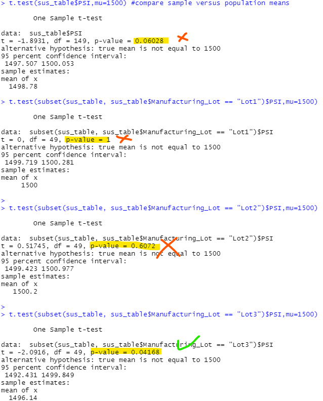

# Overview: MechaCar Statistical Analysis 

## Multiple Regression Model
Using vehicle weight, spoiler angle, ground clearance and AWD, simple multi-reg analysis was conducted to predict mpg. Results demonstrate that the said variables have a strong relationship with a Rsquared value of 71.4%. Digging further ground clearence and vehicular weight have a significant impact on mpg.  This anlysis could be improved by removing the unsignificant coeficients and the addition of new variables.  Regaurdless the relationship is strong and could be used to predict mpg.    

## Simple Visualizations for the Trip Analysis
The MechaCar Suspension_Coil.csv dataset contains the results from multiple production lots. In this dataset, the weight capacities of multiple suspension coils were tested to determine if the manufacturing process is consistent across production lots.  From the below visualization we can see the highest variance is located in lot 3.  This production line for lot 3 should be inspected
### Summary Stats

### Lot Summary Stats

## Simple T-Tests
Several T-tests were conducted to understand our sample data set of lots versus the total population of suspension coil PSI.  The Mu was provided. 
From the below results we can make the determiniation that our sample (lots 1-3) is not significantly different from the population mean. However, Lot 3 showed a significant difference from the population mean.  Pairing this with the findings on Lot 3's variance this production line most likley needs to be inspected. 

